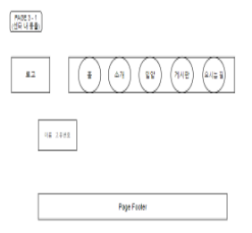

# Dog Shelter (강아지 보호소)
---
## [Web Back-end Project] 

- 요약 : (프론트단 및 백엔드단을 결합) 유기견 보호 및 입양 센터 웹 구현

- Code Source : https://github.com/bkk91/dogShelter

- 언어 : Java

- 스택 : JDK, TOMCAT 8.5, JSP, jQuery, Oracle 11.2g, MySQL Workbench

- 통합 개발 환경(IDE) : Eclipse (ver. 2021.03)

- 내용 : 비트컴퓨터 국비 교육과정, 웹 백엔드 과정 중 Front-end 와 Back-end를 결합하여 팀 별로 작업.

---
### 프로젝트 플랜 (Project plan)

 <b> 1. 개요 (Outline) </b> 

 
- 주제 : DB와 프론트의 유기적인 연동을 위하여 접근성 용이하며 데이터를 관리하기 쉬운 유기견을 선정
 
- 목표 : 주인으로 부터 버려진 유기견들을 관리, 보호하고 새로운 주인들에게 분양하기 위한 강아지 관리

- 구성 요소 : TOMCAT Server (Version 8.5), MySQL WorkBench(3.3.2), JDK(8.0) 
프로그램 사용하여 html을 jsp 파일로 변환하였고, servlet java 파일을 사용하여 TOMCAT서버에 정보를 요청, MYSQL과 연동하여 프로젝트를 구성

- 개발 지침 : 
팀 인원 6명을 3명 / 3명 나누어 작업
작업 시 FILEZILLA에 이미지 파일과 VERSION을 관리하여 지속적인 파일 작업

- 핵심 기능 : 
사용자의 Register (사용자 등록) Login / Logout
메뉴 바의 Adoption Section 에서 센터내 동물을 MySQL pet table에서 확인 
사용자가 동물을 입양할 시 pet table에서 해당 list를 삭제
adopted_pet table에 추가하여 입양된 동물을 등록과 PAGING
게시판에 사용자가 게시글 작성, 보기, 수정, 삭제 (CRUD)
게시판 관리자가 공지사항을 등록하면 게시판 내의 최 상단으로 이동하고 모든 게시물을 관리(CRUD)
Direction에 카카오 map API를 받아와서 센터로 길찾기 할 수 있는 기능

- 개발 방식 : Agile / scrum 방식을 활용하여 정해진 날짜 까지 반응형 기능을 구현 및 6명의 인원르 각각 2명씩 나누어 짝코딩.  

 

 <b> 2. 화면설계 (UI Design) </b> 

Reference1 : https://www.free-css.com/free-css-templates 
사이트 내의 page263 / dpot 자료를 참고하여 css 구성을 참고하여 html은 재구성 

Reference2 : https://unsplash.com/ 
무료 이미지 제공 사이트에서 강아지 이미지 및 무료 로고를 사용

 

 <b> 3. 핵심기능 리스트(UML) </b> 

 
 
 
  
 

 

 <b> 4. 모델링 (Modeling) </b> 

 
 

###### 모델
MySQL에 등록된 모든 데이터
a.사용자 b.강아지 c.게시판

###### 뷰
JSP로 변환된 UI를 구성하는 요소

###### 컨트롤러
서버와의 연결관리, 데이터의 CRUD를 관리하는 java클래스

 

 <b> 5. 웹 구현 (UI Implementation) </b> 

 
 
  
 
  
 
 

 

 <b> 6. 핵심기능 리스트(UML) </b> 

###### Back-end 프로젝트 구성

HTML 파일을 JSP 파일로 변환하여 WebContent의 하위 폴더 형식으로 구성

 
 
###### Tomcat Server와 MySQL DB 연결

MySQL 에 User user라는 새로운 사용자를 추가하여 table을 구상하였고,
Server -> context.xml 파일 내에 jdbc 파일 경로를 설정하여
요청이 있을 시 userdb 내의 table에 접근하도록 허용하게 context.xml 파일 작성

 

###### web.xml 작성

인코딩 양식을 맞추기 위하여 UTF-8을 인코딩하는 CharacterEncodingFilter, ContextLoaderLister 및 java resource-ref 수정.

 

###### 로그인/회원가입/로그아웃 구현

spms.vo 패키지 내의 User.java, spms.dao 패키지 내의 UserDao.java, spms.util내의 DBConnectionPool.java를 사용하여
WebContent -> auth 폴더의 regier 및 login.jsp의 요청을 주면 userdb의 usertable 내용을 추가/확인 하도록 sql문을 작성

 

 
###### 게시판 구현

위의 방식과 마찬가지로 userdb 내의 board 내용에 CRUD 기능을 추가 

 

 <b> 7. 평가 (Evaluation) </b> 

 
 프론트단 

 

---
